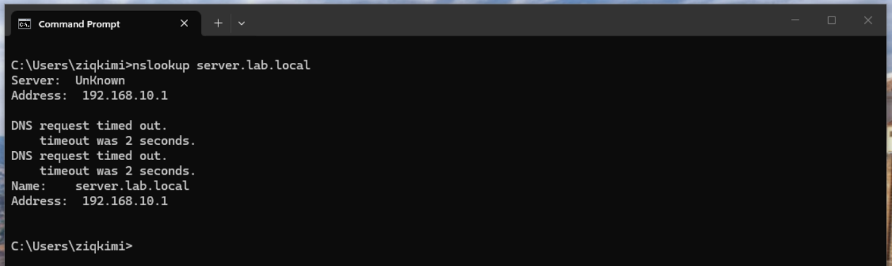
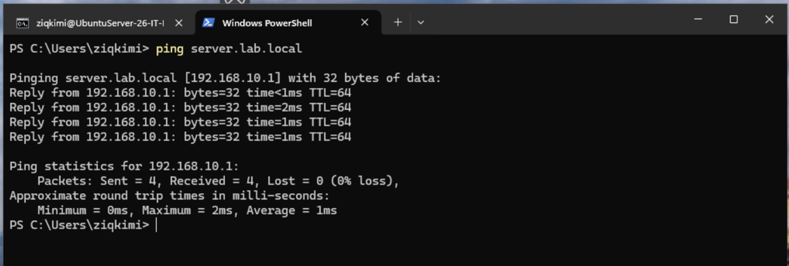
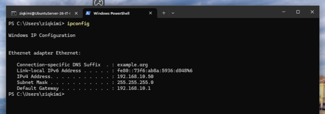

# DNS and DHCP Setup

## DNS — BIND9

BIND9 was installed on Ubuntu Server as the internal DNS server for the `lab.local` domain.

### Zone Configuration

Zone defined in `/etc/bind/named.conf.local`:

```
zone "lab.local" {
    type master;
    file "/etc/bind/db.lab.local";
};
```

### Zone File

Created `/etc/bind/db.lab.local` with A records:

```
server    IN    A    192.168.10.1
```

### Verification

nslookup confirming `server.lab.local` resolves to `192.168.10.1`:



ping confirming DNS resolution and connectivity:



---

## DHCP — isc-dhcp-server

isc-dhcp-server was installed on Ubuntu Server to automatically assign IPs to devices joining the Internal Network.

### Configuration

Subnet block in `/etc/dhcp/dhcpd.conf`:

```
subnet 192.168.10.0 netmask 255.255.255.0 {
  range 192.168.10.50 192.168.10.100;
  option domain-name-servers 192.168.10.1;
  option routers 192.168.10.1;
}
```

### Verification

Windows 11 VM receiving IP 192.168.10.50 automatically via DHCP:



---