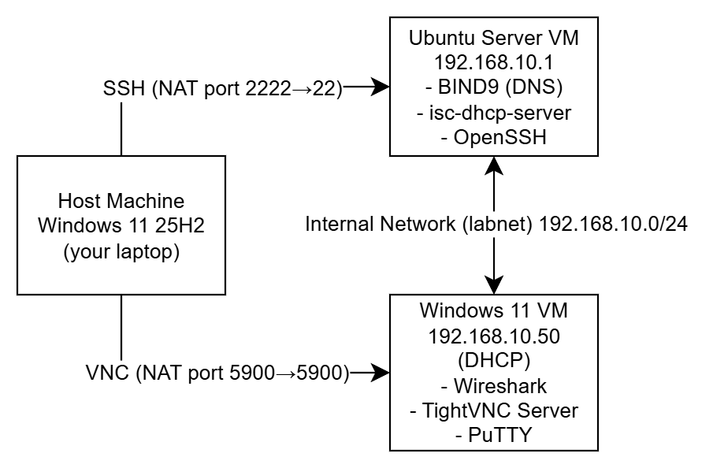

# Network Diagram

## Topology

## Device Summary

| Device | OS | IP Address | Role |
|--------|----|------------|------|
| UbuntuServer-26-IT-P2 | Ubuntu 26.04 LTS | 192.168.10.1 | DNS, DHCP, SSH Server |
| Windows-11-IT-P | Windows 11 25H2 | 192.168.10.50 | Client machine |

## Network Details

| Setting | Value |
|---------|-------|
| Network Type | VirtualBox Internal Network |
| Network Name | labnet |
| Subnet | 192.168.10.0/24 |
| DHCP Range | 192.168.10.50 – 192.168.10.100 |
| DNS Domain | lab.local |