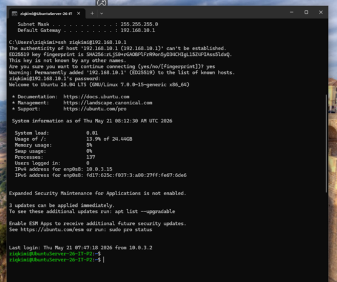
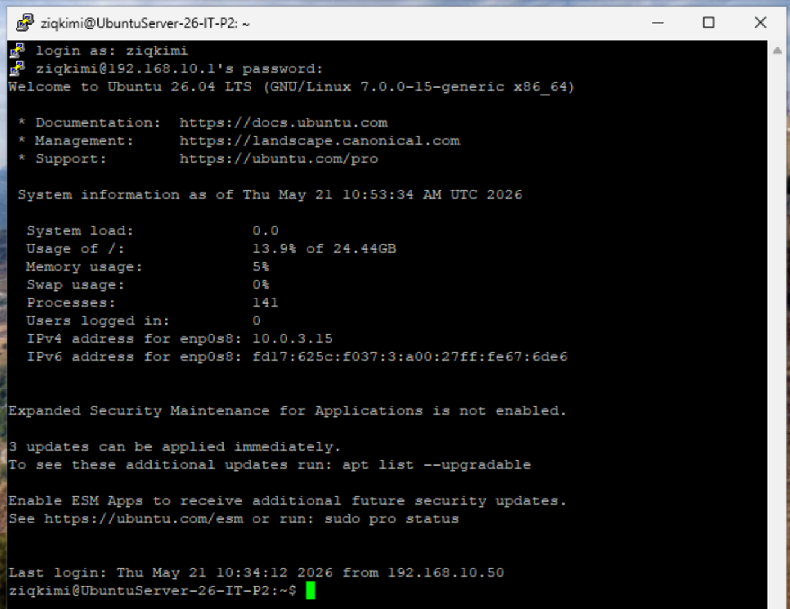
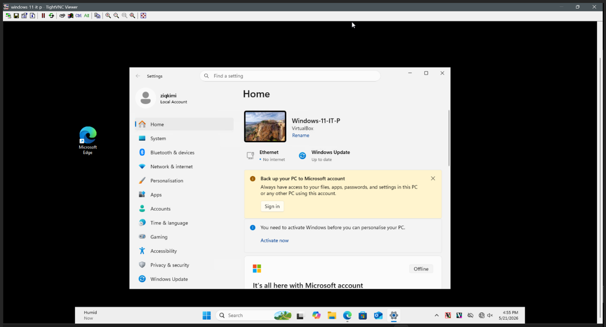

# Remote Access

## SSH — Secure Shell

OpenSSH server was installed on Ubuntu Server. SSH allows 
remote command-line access to the server without physical access.

### Real-world use case
Used by IT support to manage servers, run commands, and 
troubleshoot issues remotely.

### PowerShell SSH (VM to VM)

Connected from Windows 11 VM directly to Ubuntu via Internal 
Network IP:

### PuTTY SSH (VM to VM)

Connected using PuTTY — the standard SSH client in IT 
support environments:

---

## VNC — Virtual Network Computing

TightVNC Server was installed on Windows 11 VM for remote 
desktop access. Windows 11 Home does not support hosting RDP 
connections, so VNC was used as an alternative.

### Real-world use case
Used by helpdesk staff to remotely view and control a user's 
desktop for support purposes.

### TightVNC Session

Connected from host machine to Windows 11 VM desktop:

> **Note:** VNC and RDP serve the same purpose — remote desktop 
> access. VNC is cross-platform and commonly used in Linux 
> environments, while RDP is Windows-native. Both are standard 
> tools in IT support.