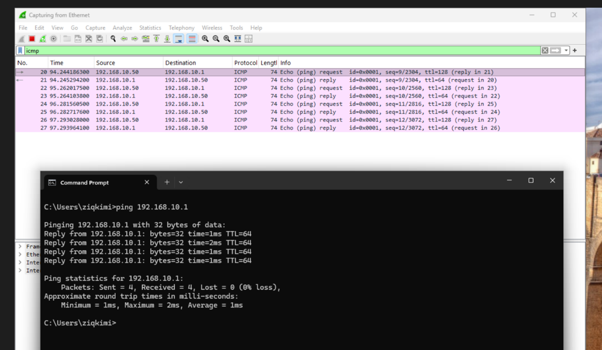
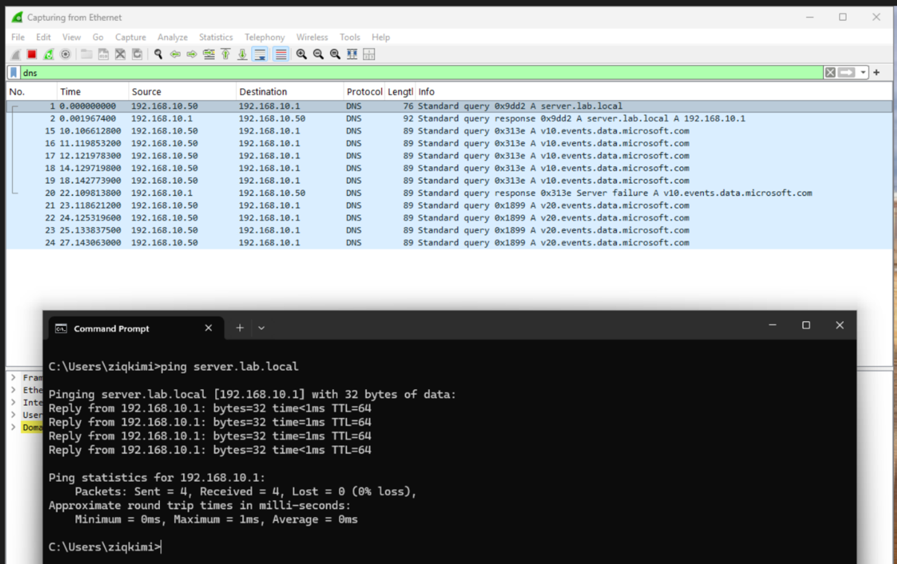
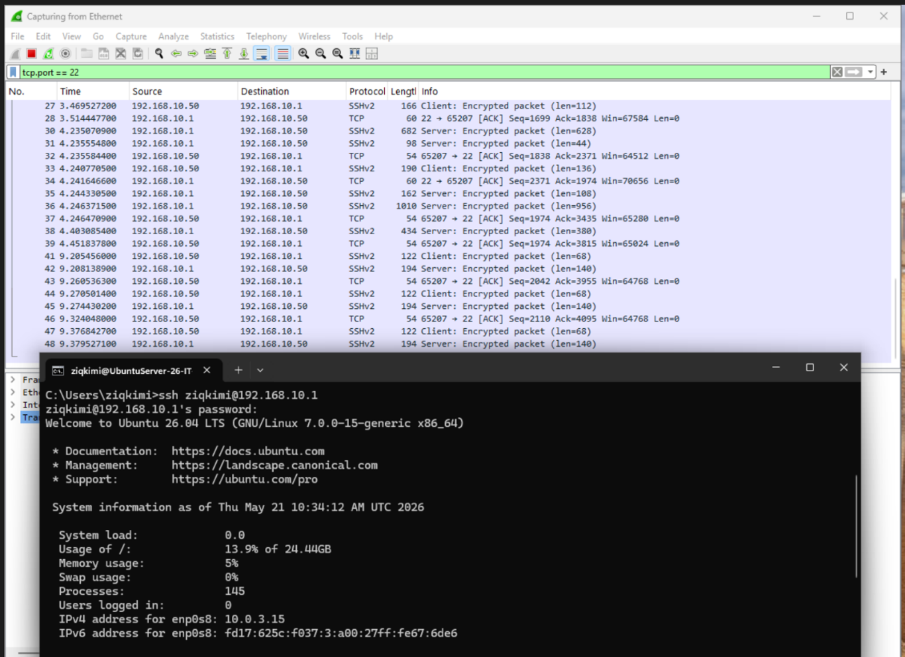

# Wireshark Network Traffic Analysis

Wireshark was installed on the Windows 11 VM to capture traffic 
directly on the Internal Network (labnet). This approach was 
chosen because the host machine accesses VMs via NAT port 
forwarding and cannot observe inter-VM traffic directly.

---

## ICMP — Ping Traffic

**Filter:** `icmp`

**What it shows:** Raw ping packets between two devices. Used 
to verify basic connectivity and measure latency.

**Real-world use:** First step in any connectivity 
troubleshooting — "can this device reach that device?"

**Observations:**
- Source: 192.168.10.50 (Windows 11 VM)
- Destination: 192.168.10.1 (Ubuntu Server)
- Protocol: ICMP Echo request and reply visible
- Response time: 1–2ms (healthy local network)

---

## DNS — Name Resolution Traffic

**Filter:** `dns`

**What it shows:** DNS query and response when resolving a 
hostname to an IP address.

**Real-world use:** Diagnosing "can't connect to server by 
name" issues — verifying DNS is resolving correctly.

**Observations:**
- Query: 192.168.10.50 asking for `server.lab.local`
- Response: 192.168.10.1 returning A record `192.168.10.1`
- Full DNS request/response cycle captured
- Additional Microsoft telemetry queries visible (normal 
  Windows background traffic)

---

## SSH — Encrypted Session Traffic

**Filter:** `tcp.port == 22`

**What it shows:** SSH handshake and encrypted session packets 
between client and server.

**Real-world use:** Verifying SSH service is running and 
accepting connections. Encrypted traffic confirms SSHv2 
is being used (not insecure SSHv1).

**Observations:**
- Source: 192.168.10.50 (Windows 11 VM)
- Destination: 192.168.10.1 (Ubuntu Server)
- Protocol: SSHv2
- All session data encrypted (Client/Server Encrypted Packet)
- TCP ACK packets confirm reliable connection